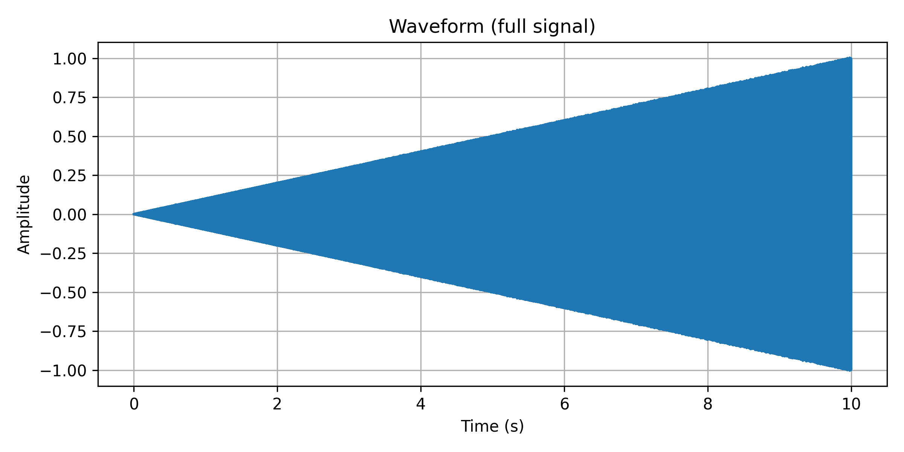
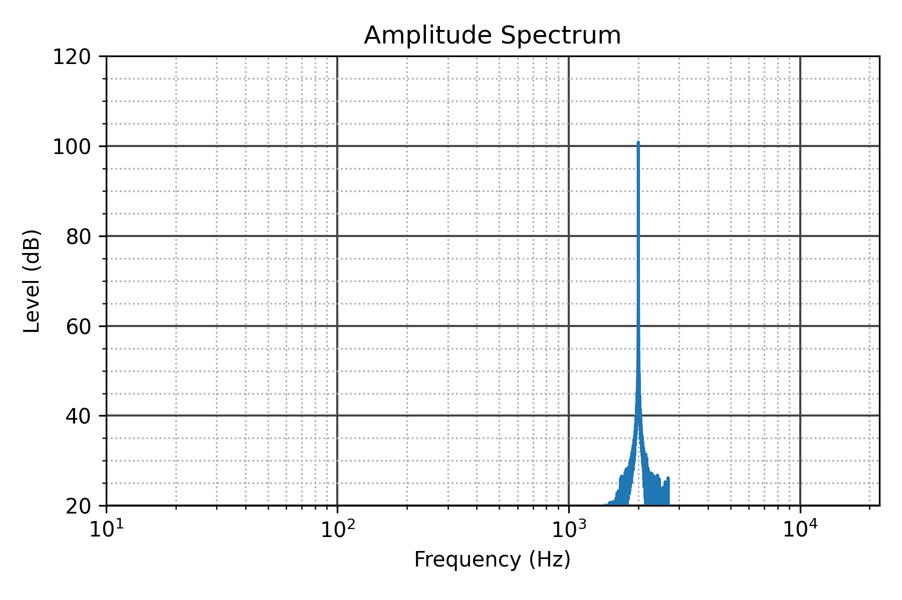
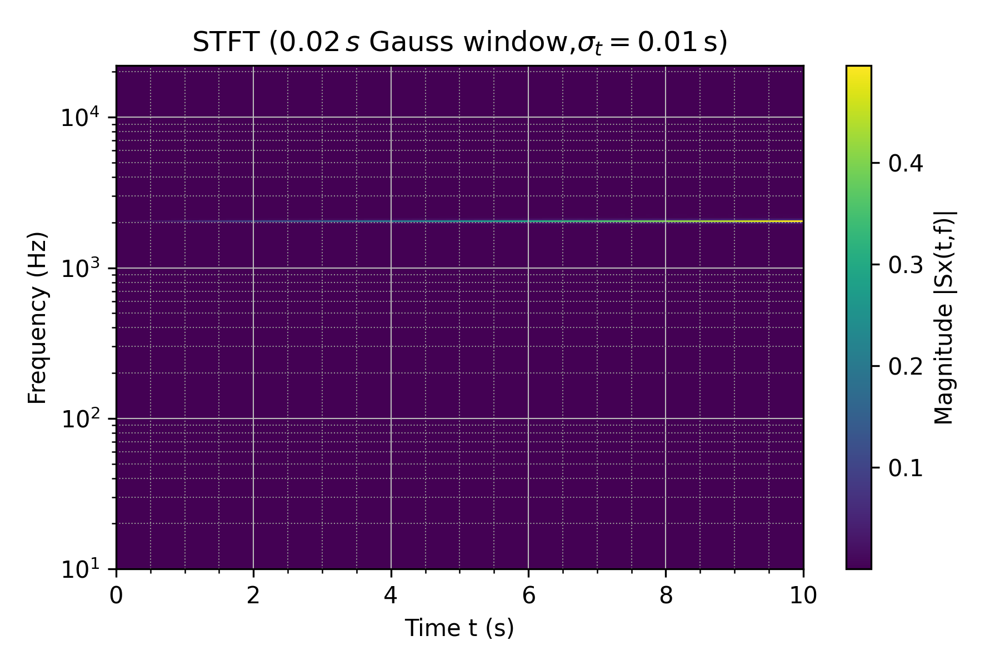

# Лабораторная работа №1. Генерация и анализ аудиосигнала

Программа генерирует десятисекундный стереосигнал частотой 2000 Гц и частотой дискретизации 44,1 кГц. Амплитуда линейно возрастает от нуля до максимума одновременно в обоих каналах. Полученный сигнал сохраняется в MP3, после чего анализируется во временной и частотной областях.

## Что реализовано

- генерация синусоидального стереосигнала с линейной огибающей;
- нормировка и сохранение аудио;
- построение полной осциллограммы и увеличенного фрагмента;
- расчет амплитудного спектра через FFT;
- построение спектрограммы с помощью STFT и окна Гаусса.

## Результаты

### Форма сигнала



### Амплитудный спектр и спектрограмма

<p align="center">
  
  
</p>

Увеличенный фрагмент сигнала доступен в файле [waveform_fragment.png](result/waveform_fragment.png), а сгенерированное аудио — в [generated.mp3](result/generated.mp3).

## Запуск

```powershell
python -m venv .venv
.\.venv\Scripts\Activate.ps1
python -m pip install -r requirements.txt
python main.py
```

Результаты сохраняются в каталог `result/`. Параметры сигнала можно изменить в функции `main()` файла `main.py`.

