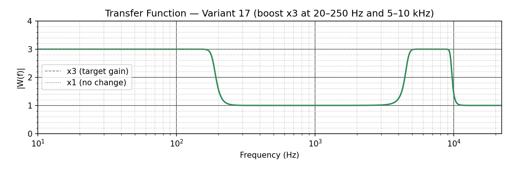
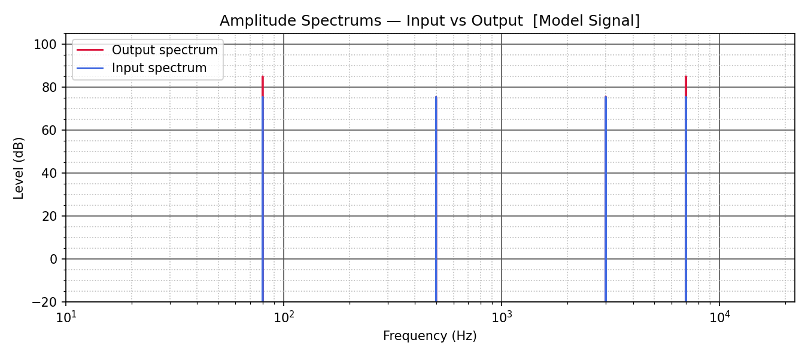
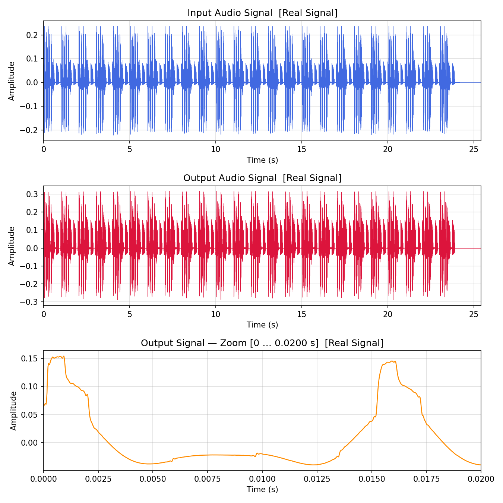
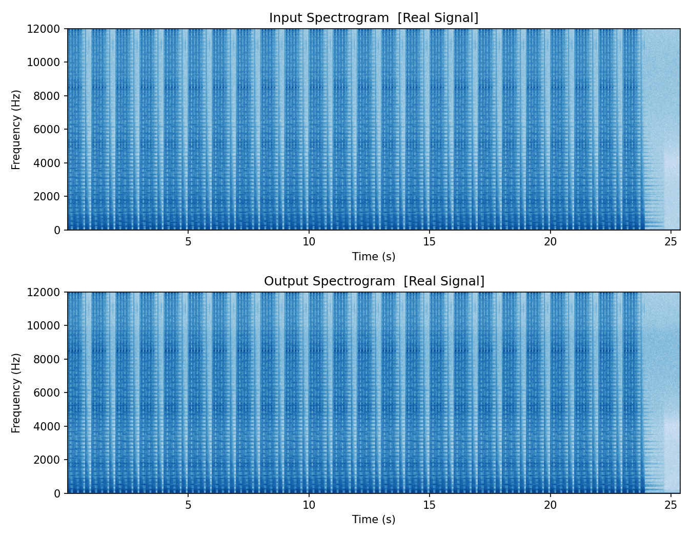

# Лабораторная работа №2. Фурье-фильтрация аудиосигналов

Работа демонстрирует обработку стереоаудио в частотной области. Для варианта 17 уровень сигнала в диапазонах 20–250 Гц и 5–10 кГц увеличивается в три раза, а остальные частоты сохраняются без изменения. Передаточная функция строится на основе полосовых фильтров Баттерворта.

## Что реализовано

- генерация модельного сигнала из тонов 80, 500, 3000 и 7000 Гц;
- прямое и обратное преобразования Фурье;
- построение симметричной передаточной функции для двух полос усиления;
- обработка модельного и реального WAV-файла;
- защита от клиппинга, сохранение аудио, спектров, сигналов и спектрограмм.

## Результаты

### Передаточная функция и спектры модельного сигнала

<p align="center">
  
  
</p>

### Обработка реального сигнала

<p align="center">
  
  
</p>

Входной файл находится в [sounds/input.wav](sounds/input.wav), результат обработки — в [sounds/output.wav](sounds/output.wav).

## Запуск

```powershell
python -m venv .venv
.\.venv\Scripts\Activate.ps1
python -m pip install -r requirements.txt
python main.py
```

Чтобы обработать другой звук, замените `sounds/input.wav` WAV-файлом. Скрипт автоматически обрабатывает моно как двухканальный сигнал и использует первые два канала многоканального файла.

