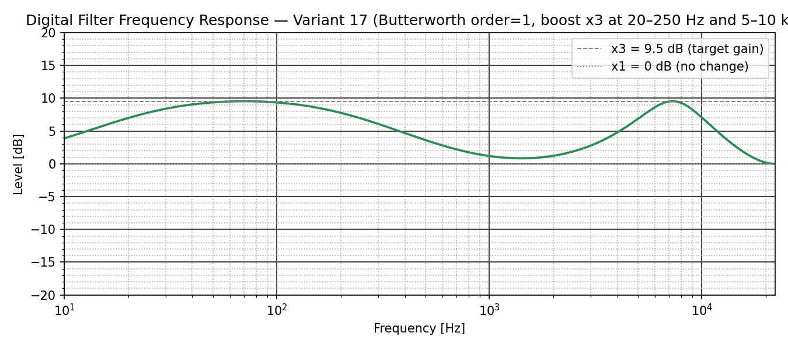
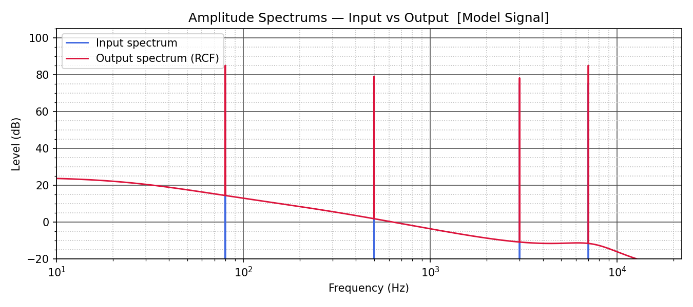
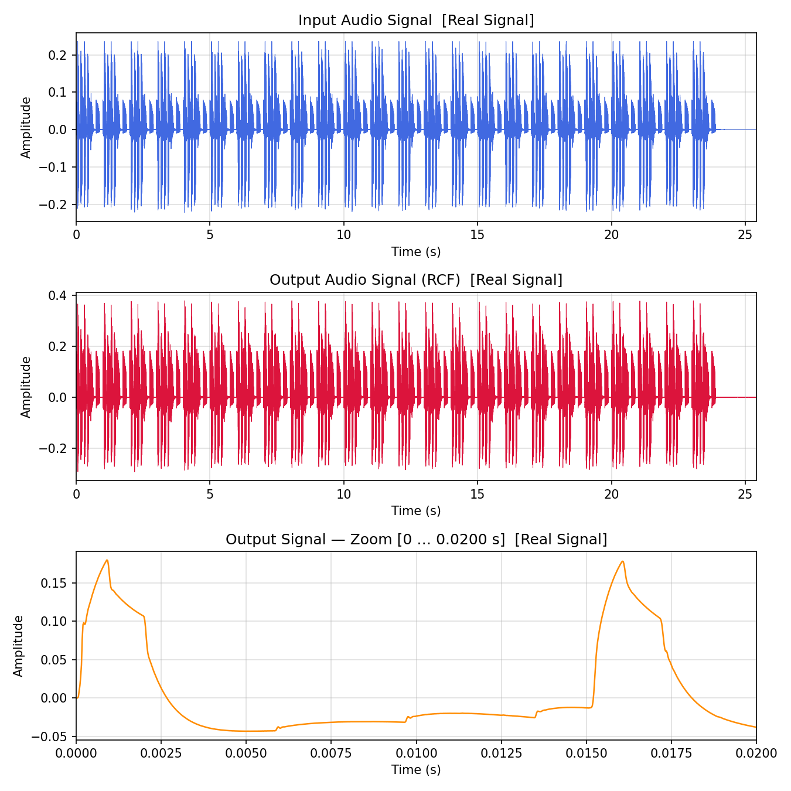
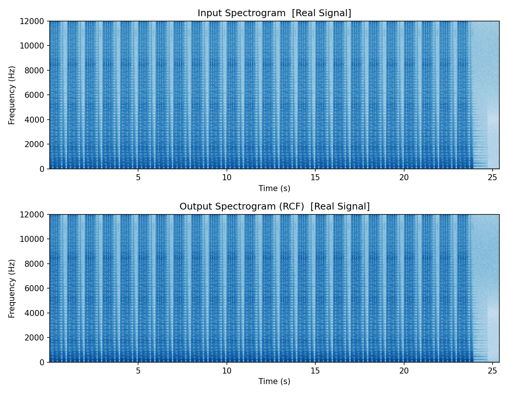

# Лабораторная работа №3. Рекурсивная фильтрация аудиосигналов

В этой работе та же частотная задача, что и в лабораторной №2, решается во временной области с помощью рекурсивных цифровых фильтров. Полосы 20–250 Гц и 5–10 кГц усиливаются в три раза путем сложения исходного сигнала с выходами полосовых IIR-фильтров Баттерворта первого порядка.

## Что реализовано

- создание модельного стереосигнала из четырех тонов;
- проектирование полосовых IIR-фильтров в форме SOS;
- рекурсивная фильтрация модельного и реального аудио;
- расчет амплитудно-частотной характеристики;
- построение временных графиков, спектров и спектрограмм;
- нормировка результата для предотвращения цифровой перегрузки.

## Результаты

### АЧХ и спектры модельного сигнала

<p align="center">
  
  
</p>

### Обработка реального сигнала

<p align="center">
  
  
</p>

Исходное аудио находится в [sounds/input.wav](sounds/input.wav), обработанное — в [sounds/output_rcf.wav](sounds/output_rcf.wav).

## Запуск

```powershell
python -m venv .venv
.\.venv\Scripts\Activate.ps1
python -m pip install -r requirements.txt
python main.py
```

Параметры полос задаются в `BOOST_BANDS`, а порядок фильтра — в `ORDER` файла `main.py`.

