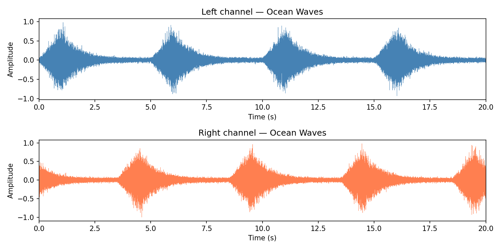
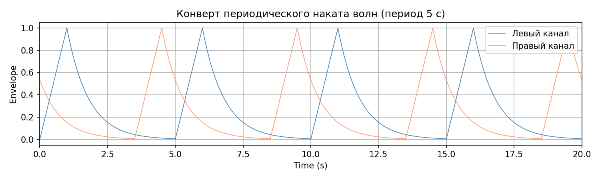
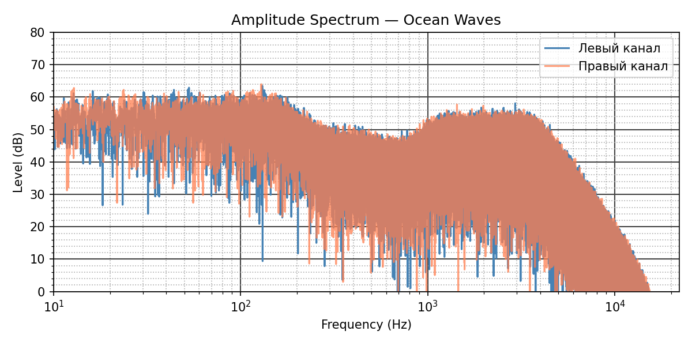

# Лабораторная работа №4. Синтез звука морского прибоя

Программа синтезирует двадцатисекундный стереофонический звук морских волн из белого шума. Формирующие фильтры создают низкочастотное тело волны, высокочастотное шипение пены и фоновый шум, а периодическая огибающая имитирует накат и затухание воды.

## Что реализовано

- четыре независимых источника белого шума;
- ФНЧ для тела волны и фонового шума;
- полосовой фильтр 1–4 кГц для шипения пены;
- медленный случайный процесс для изменения высоты волн;
- огибающая с быстрым фронтом и экспоненциальным спадом;
- смещение огибающей правого канала для стереоэффекта;
- сохранение нормированного WAV-файла и диагностических графиков.

## Результаты

### Временная форма и огибающая

<p align="center">
  
  
</p>

### Амплитудный спектр



Готовую запись можно прослушать в файле [lab4_ocean_waves.wav](lab4_ocean_waves.wav).

## Запуск

```powershell
python -m venv .venv
.\.venv\Scripts\Activate.ps1
python -m pip install -r requirements.txt
python main.py
```

При каждом запуске генерируется новая реализация шума. Частота дискретизации, длительность и период волн задаются в начале `main.py`.

