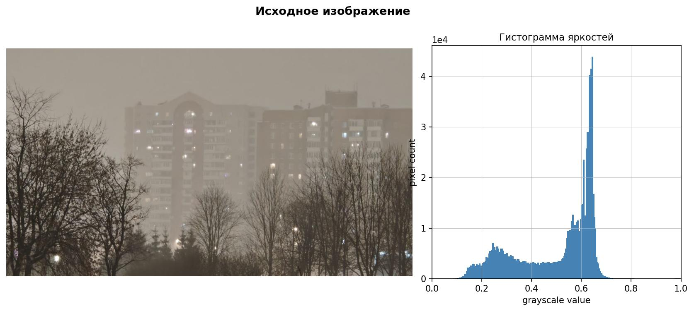
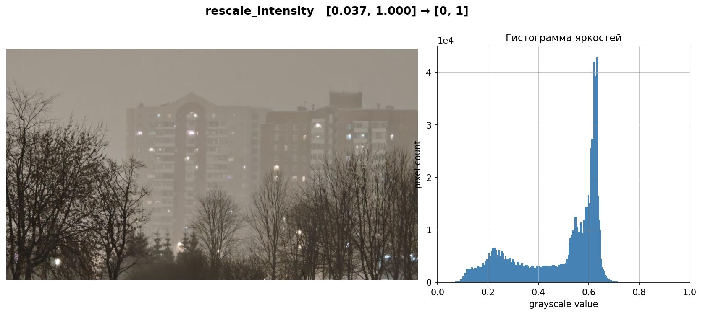
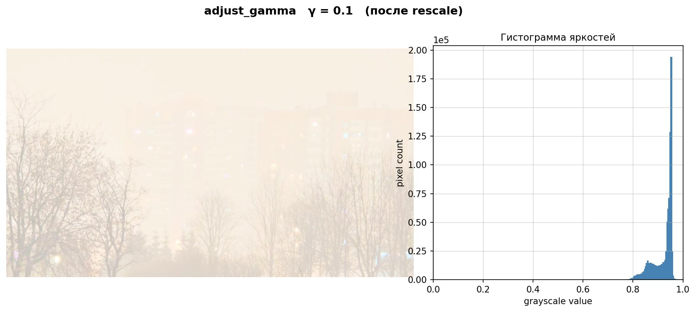
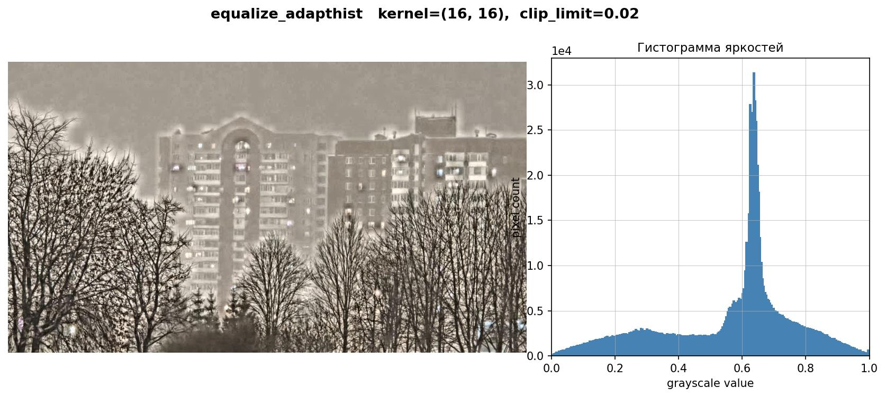

# Лабораторная работа №5. Управление контрастностью изображений

Работа сравнивает четыре способа изменения контрастности по каналу яркости цветового пространства LAB и исследует влияние параметра `clip_limit` в адаптивной гистограммной эквализации. Цветовые компоненты сохраняются, поэтому методы меняют главным образом яркость изображения.

## Что реализовано

- растяжение диапазона яркости `rescale_intensity`;
- гамма-коррекция `adjust_gamma`;
- глобальное выравнивание гистограммы `equalize_hist`;
- адаптивное выравнивание гистограммы CLAHE `equalize_adapthist`;
- сравнение пяти значений `clip_limit`;
- сохранение каждого результата вместе с гистограммой яркости.

## Сравнение методов

<p align="center">
  
  
</p>

<p align="center">
  
  
</p>

Результаты глобальной эквализации и эксперимента с `clip_limit` находятся в каталогах [part1_methods](results/part1_methods/) и [part2_clip_limit](results/part2_clip_limit/).

## Запуск

```powershell
python -m venv .venv
.\.venv\Scripts\Activate.ps1
python -m pip install -r requirements.txt
python main.py
```

Исходный файл — [input_image.jpg](input_image.jpg). Параметры `GAMMA`, `NBINS`, `KERNEL`, `CLIP_BASE` и `CLIP_VALUES` настраиваются в начале `main.py`.

